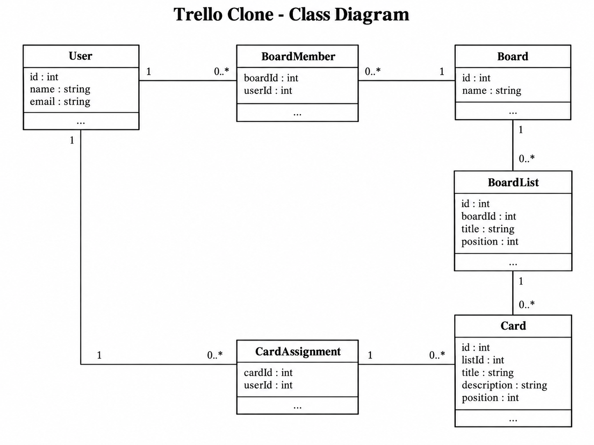
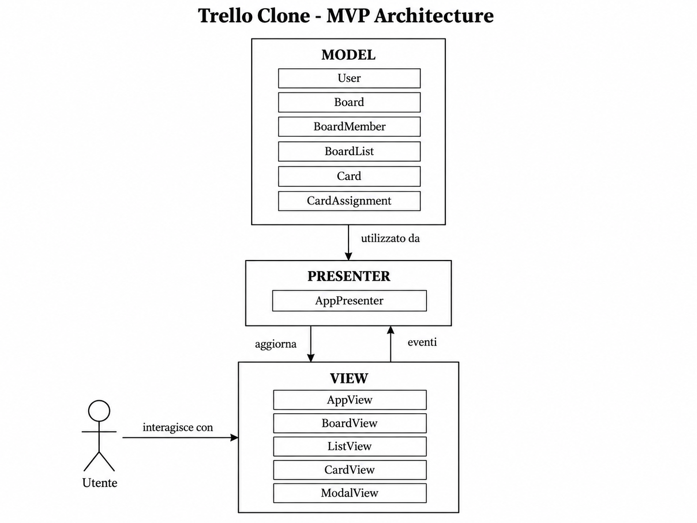

# Analisi del sistema

## 1. Attori

### Utente

L'utente è colui che utilizza l'applicazione per gestire le attività nelle board

L'utente può:

-Visualizzare le board a cui ha accesso;
-Creare una board;
-Modifcare una board;
-Eliminare una board;
-Aggiungere membri a una board;
-Creare, modificare ed eliminare liste;
-Creare, modificare ed eliminare card;
-spostare card tra liste;
-Asseganre card ai membri della board;

## 2. Entità principali

Le principali entità individuate dal dominio sono:

-User
-Board
-BoardMember
-List
-Card
-CardAssignment

## 3. Relazioni tra le entità

### User-Board

Un utente può partecipare a zero o più board.

Un board può avere uno o più utenti come membri.

La relazione tra User e Board è quindi molti a molti ed è rappresentata dall'entità BoardMember.

### Board-BoardList

Una board può contenere zero o più liste.

Ogni lista appartiene ad una sola board.

La relazione tra Board e BoardList è una a molti.

### BoardList-Card

Una lista può contenere zero o più card.

Ogni card appartiene ad una sola lista.

La relazione tra BoardList e card è una a molti.

### User-Card

Un utente può essere assegnato a zero o più card.

Una card può essere asseganta a zero o più utenti.

La relazione tra User e Card è quindi molti a molti ed è rappresentata dall'entità CardAssignment.

## 4. Regole di Dominio

-Una lista deve appartenere ad una board
-Una card deve appartenere ad una lista
-Una card può essere assegnata soalmente a utenti che appartengono alla board nella quale è contenuta
-La posizione delle liste deve essere mantenuta all'interno della board
-La posizione delle card deve essere mantenuta all'interno della lista
-Lo spostamento di una card deve aggiornare sia la lista a cui appartiene sia la sua posizione

## 5. Casi d'Uso

L'attore principale di tutto il sistema è l'utente

I principali casi d'uso individuati quindi saranno:

-Visuaiìlizzare Board
-Creare Board
-Modificare Board
-Eliminare una Board
-Aggiungere un membro ad una Board
-Creare una lista
-Modificare una lista
-Eliminare una lista
-Creare una card
-Modificare una card
-Eliminare una card
-Spostare una card
-Assegnare card ad un membro

## 6. Use Case Diagram

Il seguente diagramma rappresenta le principali iterazioni tra l'attore e l'utente e il sistema trello clone.

L'utente può gestire board, liste e card, aggiungere memebri alle board, spostare le card tra liste e asseganrle ai membri

## 7. Class Diagram

Il diagramma delle classi rappresente le principali entità del dominio e le relazioni tra esse.

Le principali sono:
-User
-Board
-BoardMember
-BoardList
-Card
-CardAssignment

Le relazioni principali sono le seguenti:

-un utente può appartenere a più board
-un board può avere più membri
-una board contiente più liste
-una lista appartiene ad una sola board
-una lista contiene più card
-una card appartiene ad una sola lista
-una card può essere asseganta ad uno o più utenti
-un utente può essere assegnato a zero o più card

## 8. Architettura MVP

L'applicazione utilizza il pattern architetturale Mode-View-Presenter, in modo da separare la logica di dominio, la rappresentazione grafica e la gestione delle interazioni dell'utente

### Model

Il Model contiene i dati dell'applicazione e la logica di dominio

Le principali calssi del Model sono:

-User
-Board
-BoardMember
-BoardList
-card
-CardAssignment

Il Model si occupa esclusivamente della rappresentazione grafica e dell'interazione con il DOM

Le principali View previste sono:

-AppView
-BoardView
-ListView
-cardView
-ModalView

La View non accede direttamente al Model e non contiene la logica di business

### Presenter

Il presenter coordina le interazioni tra Model e View

Riceve gli eventi generati dalla View, utilizza il Model per eseguire le operazioni richieste e successivamente istruisce la View su come aggiornare l'interfaccia

La classe principale prevista è:

-AppPresenter

### Diagramma dell'architettura MVP

Il seguente diagramma rappresenta la sepaazione tra Model, view e Presenter all'interno del sistema.

